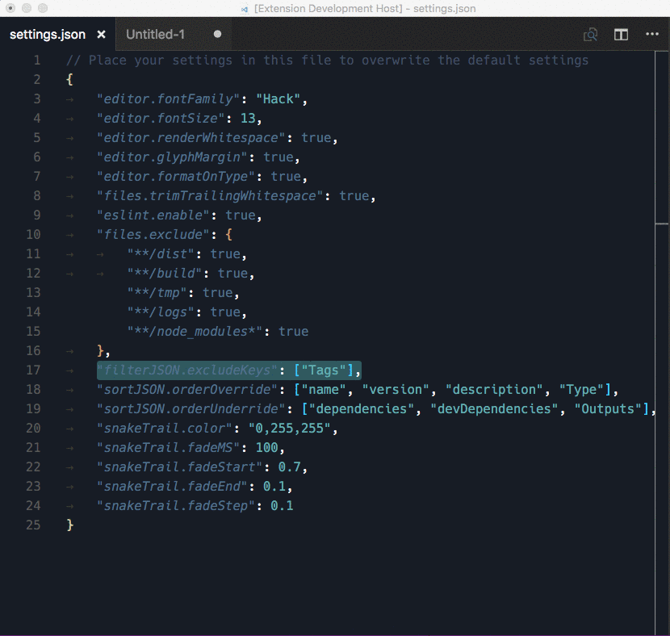

# What is it?

Filters the keys from (nested) JSON objects.

> **Please take care using this** - I've tried to ensure it won't invalidate your JSON. But, as it has to parse > filter > stringify, there is a chance it'll lose something. It should be fine for plain JSON.

> Disclaimer:

> 

# Install

* Install via VSCode extensions install

# Usage

* Select a JSON object (note, it uses full lines so ensure the selected lines are a valid JSON object)
* Run the extension (Cmd+Shift+P => Filter JSON)

# Example

# Settings

* You can editor the excluded keys. Add this to your preferences (settings.json):
    * `"filterJSON.excludeKeys": ["name", "version", "description"]`
